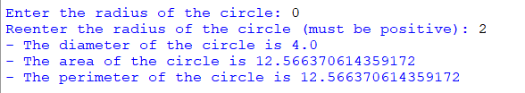

## Description
This program efficiently calculates and displays fundamental properties of a circle using a dedicated class structure. By simply inputting the circle's radius, this program computes its diameter, area, and perimeter.
## Example

